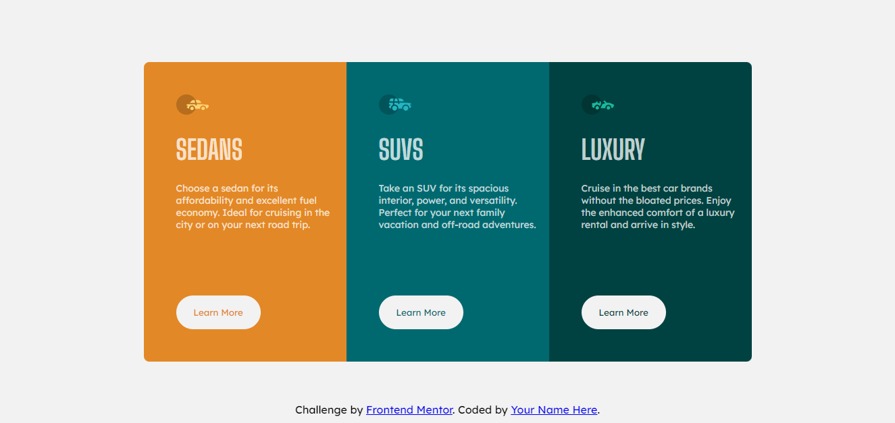

# Frontend Mentor - 3-column preview card component solution

This is a solution to the [3-column preview card component challenge on Frontend Mentor](https://www.frontendmentor.io/challenges/3column-preview-card-component-pH92eAR2-). Frontend Mentor challenges help you improve your coding skills by building realistic projects. 

## Table of contents

- [Overview](#overview)
  - [The challenge](#the-challenge)
  - [Screenshot](#screenshot)
  - [Links](#links)
- [My process](#my-process)
  - [Built with](#built-with)
  - [What I learned](#what-i-learned)
  - [Continued development](#continued-development)
- [Author](#author)

## Overview

### The challenge

Users should be able to:

- View the optimal layout depending on their device's screen size
- See hover states for interactive elements

### Screenshot

### Links

- Solution URL: [Solution URL here](https://github.com/spectrxtt/Frontend-Mentor-3-column-card-component.git)
- Live Site URL: [Live site URL here](https://spectrxtt.github.io/Frontend-Mentor-3-column-card-component/)

## My process

### Built with

- Semantic HTML5 markup
- CSS custom properties
- Flexbox
- CSS Grid

### What I learned
I have learned how to manage the use of elements in columns or rows depending on the page view.

### Continued development
I want to continue learning how to make more efficient the way to create the structure of the page and its different views according to the device. 

## Author

- Frontend Mentor - [@yourusername](https://www.frontendmentor.io/profile/spectrxtt)
- Twitter - [@yourusername](https://www.twitter.com/SPECTRE_tt)

